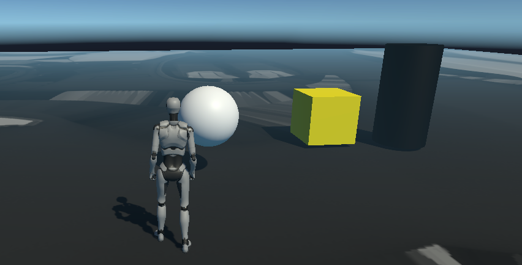

# Práctica 2 Introducción C# - Scripts
## Adrián Suárez Tabares alu0101495439
### 1 Cambio de color
Nota: la aplicación está corriendo a 120 fps

### 2 Cubo, esfera, cilindro.

### 3 Vectores

### 4 Vector Posición de la esfera

### 5 Distancia de la esfera al cubo y al cilindro

### 6 Desplazamientos al pulsar la barra espaciadora

### 7 Cambos de color

### 8 Cambio de altura y color de las esferas

